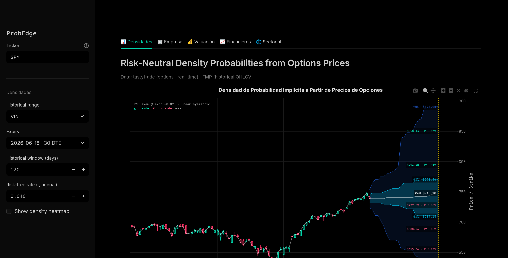

# Prob-Edge — Risk-Neutral Density SaaS for Options Markets

Quantitative options-analytics platform that recovers **risk-neutral densities (RNDs)** from live U.S. option chains using the **Breeden–Litzenberger** framework and visualizes them as a 68% / 95% probability cone over historical price action.

> Institutional desks read the market's full implied distribution, not just IV or Greeks. Retail tools stop at single-number volatility. Prob-Edge gives advanced retail and prosumer traders the same shape institutional desks see.

🔗 **Live demo:** [risk-neutral-density-probabilities-3.onrender.com](https://risk-neutral-density-probabilities-3.onrender.com)



---

## What it does

For any U.S.-listed equity or ETF with a liquid option chain:

1. Pulls the live option chain (calls + puts, all strikes for the chosen expiry).
2. Recovers the **risk-neutral density** *q(K)* from clean call prices:
   - Put-call parity to derive a coherent call surface,
   - PCHIP interpolation across strikes,
   - Numerical second derivative w.r.t. strike (Breeden–Litzenberger: *q(K) = e^{rT} · ∂²C/∂K²*),
   - Forward-correction normalization to enforce *∫q(K) dK ≈ 1* and *E_Q[S_T] ≈ S_0 · e^{(r−q)T}*.
3. Builds a time-price density grid and renders a **probability cone** on top of historical OHLC candles (terminal-style dark theme), with 68% / 95% bands and the risk-neutral median.

Formal derivation in [`metodologia.md`](./metodologia.md).

## Architecture

```
UI (Streamlit, dark theme)
     │
     ├─→ modules/data_loader.py       ← option chain + OHLC fetch (cached)
     ├─→ modules/rnd_math.py          ← Breeden–Litzenberger pipeline + PCHIP
     ├─→ modules/plots.py             ← OHLC + cone + heatmap rendering
     │
     └─→ FastAPI backend (api/)
              ├─ JWT auth
              ├─ async SQLAlchemy credit ledger
              ├─ Stripe subscriptions & per-plan rate limiting
              └─ tastytrade OAuth2 (Personal Grant) for live option chains
```

Two-tier deployment: the Streamlit app is consumer-facing; the FastAPI service handles auth, billing, rate limiting, and tastytrade token rotation behind the scenes.

## Stack

- **Language / runtime:** Python 3.13
- **Quant core:** NumPy · SciPy · custom Breeden–Litzenberger pipeline with PCHIP regularization
- **Front-end:** Streamlit (Bloomberg / tastytrade-style dark UI) · Plotly
- **Back-end:** FastAPI · Uvicorn · async SQLAlchemy · JWT · Stripe · python-dotenv
- **Data:**
  - Options chains: **tastytrade** API (OAuth2 Personal Grant) — only auth method that works under Render's egress
  - Historical OHLC: **Financial Modeling Prep**
- **Deployment:** Docker · Render (Dockerfile + `render.yaml`)

## Repository layout

| Path | Purpose |
|---|---|
| `app.py` | Streamlit entry point |
| `modules/` | RND math, data loaders, plot helpers |
| `api/` | FastAPI service (auth, billing, credit ledger) |
| `metodologia.md` | Formal derivation of the RND pipeline |
| `PROJECT_SPEC.md` | Product spec — audience, scope, screens |
| `PROJECT_STATUS.md` | Current status and roadmap |
| `Dockerfile` · `render.yaml` | Container + Render deployment |
| `.env.example` | Environment template (real values must live in `.env`, gitignored) |

## Local development

```bash
git clone https://github.com/leoromero-quant/prob-edge.git
cd prob-edge
cp .env.example .env   # fill FMP_API_KEY, MASSIVE_API_KEY, TASTYTRADE_*, STRIPE_*, JWT_SECRET_KEY
pip install -r requirements.txt
streamlit run app.py
```

The `.env.example` documents every env var (data-provider keys, tastytrade OAuth Personal Grant, Stripe, JWT, DB URL).

## Author

**Leonardo Suárez Romero, PhD** — Quantitative Data Analyst.
[leoromero.dev](https://leoromero.dev) · [LinkedIn](https://linkedin.com/in/leonardo-suarez-romero)

## License & Copyright

Copyright © 2025–2026 **Leonardo Suárez Romero**. All rights reserved.

Private — source available for inspection only. No license is granted to copy, modify, distribute, sublicense, or use this software, its methodology, or any derivative work for commercial purposes without explicit written permission from the author. See [`COPYRIGHT.md`](./COPYRIGHT.md) for the full intellectual-property declaration, including the scope of the Breeden–Litzenberger + PCHIP pipeline, the timestamped authorship statement, and the bilingual notice in Spanish.
